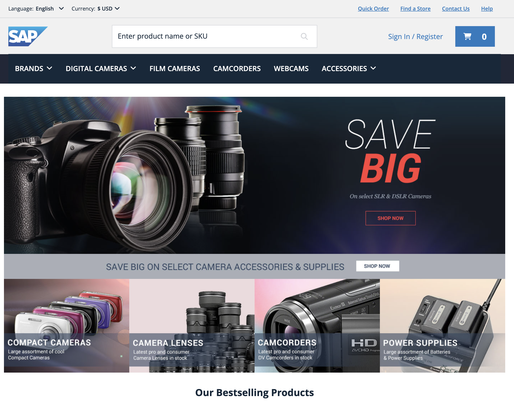

# Supercharge your SAP Composable Storefront with Amazon CloudFront

This project describes a seamless integration of Amazon CloudFront as Content Delivery Network (CDN) with SAP Composable Storefront and SAP Commerce Cloud. It provides an easy setup process, configuration best practices, and techniques to optimize your e-commerce store website performance. 

## Architecture


## Prerequisites
To deploy the required AWS infrastructure the following prerequisites must be checked:  

-   Create [Amazon Route53 public hosted zone](https://docs.aws.amazon.com/Route53/latest/DeveloperGuide/CreatingHostedZone.html) with your domain name. Note down the zone id, it will be used later.
-   Configure and deploy [SAP Commerce Cloud for SAP Composable Storefront](https://help.sap.com/docs/SAP_COMMERCE_COMPOSABLE_STOREFRONT/cfcf687ce2544bba9799aa6c8314ecd0/3d3ff86d93224779b4ee166e8e289821.html?locale=en-US)
-   [Setup SAP Composable Storefront](https://help.sap.com/docs/SAP_COMMERCE_COMPOSABLE_STOREFRONT/cfcf687ce2544bba9799aa6c8314ecd0/ea187052be724bbf8796d1ba86131781.html?locale=en-US) from the libraries. You need to change the baseSite to point to the same domain name that is resolving the CloudFront distribution. Here an example:


Build the SAP Composable Storefront application and deploy to the s3 bucket. Here some sample commands:  
```console
cd <YOUR-COMPOSABLE-STOREFRONT-PROJECT>/
rm -rf dist && npx npm install && npx npm run build
aws s3 sync ./dist/mystore/browser s3://<THE-BUCKET-NAME>/mystore
```

Also, it’s imporant to invalidate the cache on CloudFront to ensure fresh content.  
```console
aws cloudfront create-invalidation --distribution-id <CLOUDFRONT_DISTRIBUTION_ID> --paths "/*"
```

## Deployment

All the required AWS infrastructure is available in this github repository URL_PLACEHOLDER.  

- First You need to clone the [git repository](https://gitlab.aws.dev/my-blogs1/sap-commerce-cloud-cloudfront/amazon-cloudfront-for-sap-commerce-cloud-cdk):

```console
git clone git@ssh.gitlab.aws.dev:my-blogs1/sap-commerce-cloud-cloudfront/amazon-cloudfront-for-sap-commerce-cloud-cdk.git && cd amazon-cloudfront-for-sap-commerce-cloud-cdk
```

- In the project directory you need to deploy the CDK script.

```console
npx aws-cdk deploy \
--parameters sapBucketNameParam=<THE-BUCKET-NAME> \
--parameters hostedZoneIdParam=<THE-HOSTED-ZONE-ID> \
--parameters domainNameParam=<YOUR-ROOT-DOMAIN-NAME>\
--parameters siteNameParam=electronics-spa \
--parameters sapCommerceCloudApiAspectEndpointParam=mystore \
--parameters composableStorefrontStoreNameParam=<SAP-COMMERCE-CLOUD-ENDPOINT-URL>
```  
  
The output of command should be something like this:


After this you should browser to: `https://<YOUR-ROOT-DOMAIN-NAME>` and get the Composable Storefront.



## Cleanup

To cleanup you need to execute the following commands in the CDK project:  
```console
aws s3 rm —recursive s3://<THE-BUCKET-NAME>/mystore
npx cdk destroy --force
```